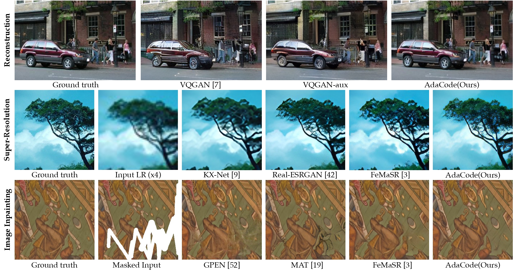

# AdaCode

This repository provides the official implementation for the paper 

> **Learning Image-Adaptive Codebooks for Class-Agnostic Image Restoration**<br>
> [Kechun Liu](https://kechunl.github.io/), Yitong Jiang, Inchang Choi, [Jinwei Gu](https://www.gujinwei.org/)<br>
> In ICCV 2023.

[](https://arxiv.org/abs/2306.06513)
[](https://kechunl.github.io/AdaCode/)
[](https://www.youtube.com/watch?v=GOp-4kbgyoM)
> **Abstract:** Recent work of discrete generative priors, in the form of codebooks, has shown exciting performance for image reconstruction and restoration, since the discrete prior space spanned by the codebooks increases the robustness against diverse image degradations. Nevertheless, these methods require separate training of codebooks for different image categories, which limits their use to specific image categories only (e.g. face, architecture, etc.), and fail to handle arbitrary natural images. **In this paper, we propose AdaCode for learning image-adaptive codebooks for classagnostic image restoration. Instead of learning a single codebook for all categories of images, we learn a set of basis codebooks. For a given input image, AdaCode learns a weight map with which we compute a weighted combination of these basis codebooks for adaptive image restoration.** Intuitively, AdaCode is a more flexible and expressive discrete generative prior than previous work. Experimental results show that AdaCode achieves state-of-the-art performance on image reconstruction and restoration tasks, including image super-resolution and inpainting.



---
### Dependencies and Installation

- Ubuntu >= 18.04
- CUDA >= 11.0
- Other required packages in `requirements.txt`
``` 
# git clone this repository
git clone https://github.com/kechunl/AdaCode.git
cd AdaCode 

# create new anaconda env
conda create -n AdaCode python=3.8
conda activate AdaCode 

# install python dependencies
pip install -r requirements.txt
python setup.py develop
```

---

### Inference

```
# super resolution
python inference.py -i ./testset/sr -t sr -s 2 -o results_x2/
python inference.py -i ./testset/sr -t sr -s 4 -o results_x4/

# inpainting
python inference.py -i ./testset/inpaint -t inpaint -o results_inpaint/
```

## Train the model

### Preparation

#### Dataset

Please prepare the training and testing data follow descriptions in the [paper](https://arxiv.org/abs/2306.06513). In brief, you need to crop 512 x 512 high resolution patches, and generate the low resolution patches with [`degradation_bsrgan`](https://github.com/cszn/BSRGAN/blob/3a958f40a9a24e8b81c3cb1960f05b0e91f1b421/utils/utils_blindsr.py?_pjax=%23js-repo-pjax-container%2C%20div%5Bitemtype%3D%22http%3A%2F%2Fschema.org%2FSoftwareSourceCode%22%5D%20main%2C%20%5Bdata-pjax-container%5D#L432) function provided by [BSRGAN](https://github.com/cszn/BSRGAN). You may find `generate_dataset.py` and `generate_inpaint_datset.py` useful in generating low resolution and masked patches.

#### Model preparation

Before training, you need to
- Download the pretrained stage 2 model: [generator](https://github.com/kechunl/AdaCode/releases/download/v0-pretrain_models/AdaCode_S2_model_g.pth), [discriminator](https://github.com/kechunl/AdaCode/releases/download/v0-pretrain_models/AdaCode_S2_model_d.pth) 
- Put the pretrained models in `experiments/pretrained_models`
- Specify their path in the corresponding option file.

### Train SR model

```
python basicsr/train.py -opt options/stage3/train_Adacode_stage3.yaml
```

## Acknowledgement

This project is based on [FeMaSR](https://github.com/chaofengc/FeMaSR).